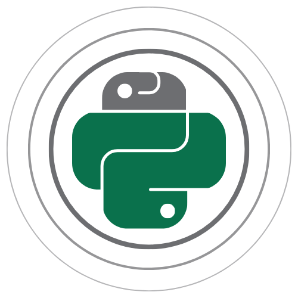

# Morelia

## Introduction 

Morelia is a free, open-source Python application programming interface (API) for Pinnacle Technology, Inc. data acquisition POD devices. Morelia core modules, usage examples, and supporting documentation can be found here on GitHub and are available freely under the New BSD License. 

The [SetupAllDevices](/Documents/API_Manuals/SetupAllDevices_Package_Manual.pdf) Python package is designed to be a simple and user-friendly method to setup and stream data from Data Conditioning and Acquisition System POD devices. With this module, you can control several aspects of the hardware. You can connect multiple POD devices and stream data simultaneously. Data can be saved to either EDF or text files. SetupAllDevices uses several supporting classes to interface with the POD devices. The user can use these same modules to code their own personalized data acquisition systems. 

Currently, the API supports 8206-HR, 8401-HR, 8229, and 8480-SC POD devices. In the future, we will offer support to other Pinnacle devices. 

* Code documentation: [here](https://python-pod-api.readthedocs.io/en/latest/)
* PDF Manual: [here](/Documents/API_Manuals/Python_POD_API_Manual.pdf)

## Collaboration 

This project is open-source; all code is freely and publically accessible for anyone to use. We welcome anyone who wishes to contribute to this project. If you are interested in collaborating, here are some steps to get started:

1. Fork this repository. This will create a repo on your own GitHub account.
2. Clone your forked project to your local machine. The clone link can be found under the "Code" icon on the GitHub repo.
3. Create a new branch where you can develop your code. Stage, commit, and push any changes to your fork.
4. Create a pull request and write comments describing the code changes and the reason for the pull request. This targets the original repository.
5. The repository maintainers will review your pull request. If approved, your code will be merged into this repo.

## Project Setup

Here are some useful documents for setting up your coding environment to use the Python modules in this project:

* Tips for installing your Python environment: [here](/Documents/Programming_Tutorials/PythonEnviornmentTips.txt)

* Python libraries required for this project: [here](/Code/requirements.txt)
   * Run ``pip install -r ./requirements.txt`` in terminal in the PodApi/Code directory. 

# PodApi Package

* PodApi package docs: [here](https://python-pod-api.readthedocs.io/en/latest/PodApi.html)
* Import package: ``import PodApi``

The **PodApi** package is used to operate POD devices. It contains four sub-packages: Devices, Packets, Commands, and Parameters. The **Devices** package is used to create a Pod device object that is connected to a physical device. Devices has a sub-package, **SerialPorts**, which facilitates communication to a POD device through a serial port; this allows the user to read and write data to a POD device. The **Packets** package contains container classes to store serial data packets that are written to or read from a POD device. The **Commands** package stores all the types of commands and their respective information that a POD device can interpret. The **Parameters** package consists of container classes used to store information about the various POD devices; this class is independent of any physical POD device. Lastly, the **Stream** package contains tools to stream and save data from a POD device to a local file; Stream has **Drain** as a sub package, which handles writing to a file (this also has a sub-package, **PodHander**, which interprets streaming data for different POD devices).

The class diagram of the PodApi package is shown below.

## Examples & Usage 

| Module                                                        | Description                                  |
|---------------------------------------------------------------|----------------------------------------------|
| [Using_8206HR.py](/Code/Examples/UsingPodApi/Using_8206HR.py) | Runs all commands for an 8206-HR POD device. |
| [Using_8401HR.py](/Code/Examples/UsingPodApi/Using_8401HR.py) | Runs all commands for an 8401-HR POD device. |
| [Using_8229.py](/Code/Examples/UsingPodApi/Using_8229.py)     | Runs all commands for an 8229 POD device.    |
| [Using_8480SC.py](/Code/Examples/UsingPodApi/Using_8480SC.py) | Runs all commands for an 8480-SC POD device. |
| [Using_8274D.py](/Code/Examples/UsingPodApi/Using_8274D.py)   | Runs all commands for an 8274-D POD device.  |
| [Using_Stream.py](/Code/Examples/UsingPodApi/Using_Stream.py) | demonstrates how to use PodApi.Stream to save streaming data to a file from a 8206-HR POD device. | 

## Sub-packages

### Devices

* PodApi.Devices package docs: [here](https://python-pod-api.readthedocs.io/en/latest/PodApi.Devices.html)
* Import clases: ``from PodApi.Devices import BasicPodProtocol, Pod8206HR, Pod8401HR, Pod8229, Pod8480SC``

| Class                                                    | Description                                         |
|----------------------------------------------------------|-----------------------------------------------------|
| [Pod](/Code/PodApi/Devices/BasicPodProtocol.py)          | Handle basic communication with a POD device, including reading and writing packets and packet interpretation. |
| [Pod8206HR](/Code/PodApi/Devices/PodDevice_8206HR.py.py) | Handles communication using an 8206-HR POD device.  |
| [Pod8401HR](/Code/PodApi/Devices/PodDevice_8401HR.py)    | Handles communication using an 8401-HR POD device.  |
| [Pod8229](/Code/PodApi/Devices/PodDevice_8229.py)        | Handles communication using an 8229 POD device.     | 
| [Pod8480SC](/Code/PodApi/Devices/PodDevice_8480SC.py)    | Handles communication using an 8480-SC POD device.  | 
| [Pod8274D](/Code/PodApi/Devices/PodDevice_8274D.py)      | Handles communication using an 8274-D POD device.   | 
 
### SerialPorts

* PodApi.SerialPorts package docs: [here](https://python-pod-api.readthedocs.io/en/latest/PodApi.Devices.SerialPorts.html)
* Import clases: ``from PodApi.Devices.SerialPorts import SerialComm``

| Class                                                       | Description                                                     |
|-------------------------------------------------------------|-----------------------------------------------------------------|
| [FindPorts](/Code/PodApi/Devices/SerialPorts/PortAccess.py) | Contains methods for the user to view and select a serial port. |
| [PortIO](/Code/PodApi/Devices/SerialPorts/SerialComm.py)    | Handle serial communication (read/write) using COM ports.       |

### Packets

* PodApi.Packets package docs: [here](https://python-pod-api.readthedocs.io/en/latest/PodApi.Packets.html)
* Import clases: ``from PodApi.Packets import Packet, Standard, Binary, Binary4, Binary5``

| Class                                              | Description                                                                    |
|----------------------------------------------------|--------------------------------------------------------------------------------|
| [Packet](/Code/PodApi/Packets/Packet.py)           | Container class that stores a command packet for a POD device. This class also collection of methods for creating and interpreting POD packets. |
| [PacketStandard](/Code/PodApi/Packets/Standard.py) | Container class that stores a standard command packet for a POD device.        |
| [PacketBinary](/Code/PodApi/Packets/Binary.py)     | Container class that stores a standard binary command packet for a POD device. |
| [PacketBinary4](/Code/PodApi/Packets/Binary4.py)   | Container class that stores a binary4 command packet for a POD device.         |
| [PacketBinary5](/Code/PodApi/Packets/Binary5.py)   | Container class that stores a binary5 command packet for a POD device.         |

### Commands

* PodApi.Commands package docs: [here](https://python-pod-api.readthedocs.io/en/latest/PodApi.Commands.html)
* Import clases: ``from PodApi.Commands import PodCommands``

| Class                                              | Description                                                          |
|----------------------------------------------------|----------------------------------------------------------------------|
| [CommandSet](/Code/PodApi/Commands/PodCommands.py) | Manages a dictionary containing available commands for a POD device. |

### Parameters

* PodApi.Parameters package docs: [here](https://python-pod-api.readthedocs.io/en/latest/PodApi.Parameters.html)
* Import clases: ``from PodApi.Parameters import Params, Params8206HR, Params8401HR, Params8229, Params8480SC``

| Class                                                   | Description                                                              |
|---------------------------------------------------------|--------------------------------------------------------------------------|
| [Params](/Code/PodApi/Parameters/ParamsBasic.py)        | Interface for a container class that stores parameters for a POD device. | 
| [Params8206HR](/Code/PodApi/Parameters/Params8206HR.py) | Container class that stores parameters for a 8206-HR POD device.         | 
| [Params8401HR](/Code/PodApi/Parameters/Params8401HR.py) | Container class that stores parameters for a 8401-HR POD device.         | 
| [Params8229](/Code/PodApi/Parameters/Params8229.py)     | Container class that stores parameters for a 8229 POD device.            | 
| [Params8480SC](/Code/PodApi/Parameters/Params8480SC.py) | Container class that stores parameters for a 8480-SC POD device.         |
| [Params8274D](/Code/PodApi/Parameters/Params8274D.py)   | Container class that stores parameters for a 8274-D POD device.         | 

### Stream

* PodApi.Stream package docs: [here](https://python-pod-api.readthedocs.io/en/latest/PodApi.Stream.html)
* Import clases: ``from PodApi.Stream import Bucket, Valve, Hose, Bucket, DrainBucket``

| Class                                             | Description                                                                                                   |
|---------------------------------------------------|---------------------------------------------------------------------------------------------------------------|
| [Bucket](/Code/PodApi/Stream/DataBucket.py)       | Class to collect the data and timestamps when streaming from a POD device.                                    | 
| [Hose](/Code/PodApi/Stream/DataHose.py)           | Collects streaming data from an 8206-HR or 8401-HR POD device. The data and timestamps are updated about every 1 second when streaming. | 
| [Valve](/Code/PodApi/Stream/DeviceValve.py)       | Simple class to start and stop streaming data from a POD device.                                              |
| [DrainBucket](/Code/PodApi/Stream/DrainToFile.py) | This class is used to save the streaming data from a POD device that was collected by a Bucket into a file.   | 

### Drain

* PodApi.Stream.Drain package docs: [here](https://python-pod-api.readthedocs.io/en/latest/PodApi.Stream.Drain.html)
* Import clases: ``from PodApi.Stream.Drain import DrainToFile, DrainToTXT, DrainToEDF``

| Class                                              | Description                                                                              |
|----------------------------------------------------|------------------------------------------------------------------------------------------|
| [DrainToEDF](/Code/PodApi/Stream/Drain/ToEDF.py)   | Class to to drain, or save, the data drops collected by a Bucket into an EDF file.       | 
| [DrainToFile](/Code/PodApi/Stream/Drain/ToFile.py) | Interface class to to drain, or save, the data drops collected by a Bucket into a file.  | 
| [DrainToTXT](/Code/PodApi/Stream/Drain/ToText.py)  | Class to to drain, or save, the data drops collected by a Bucket into a text file.       | 

### PodHandler

* PodApi.Stream.Drain.PodHandler package docs: [here](https://python-pod-api.readthedocs.io/en/latest/PodApi.Stream.Drain.PodHandler.html)
* Import clases: ``from PodApi.Stream.Drain.PodHandler import DrainDeviceHandler, Drain8206HR, Drain8401HR``

| Class                                                                          | Description                                                              |
|--------------------------------------------------------------------------------|--------------------------------------------------------------------------|
| [Drain8206HR](/Code/PodApi/Stream/Drain/PodHandler/Handle8206HR.py)            | Class to help handle 8206-HR POD devices for the Drain classes.          | 
| [Drain8401HR](/Code/PodApi/Stream/Drain/PodHandler/Handle8401HR.py)            | Class to help handle 8206-HR POD devices for the Drain classes.          |
| [Drain8274D](/Code/PodApi/Stream/Drain/PodHandler/Handle8274D.py)              | Class to help handle 8274D POD devices for the Drain classes.            |
| [DrainDeviceHandler](/Code/PodApi/Stream/Drain/PodHandler/HandlerInterface.py) | Interface class for the POD device handlers used by the Drain classes.   |

## Setup Package

The **Setup** package, which uses the PodAPi package, walks the user through a process to set up and run a POD device. Setup consists of three sub-packages: SetupAllDevices, SetupOneDevice, and Inputs. The **SetupAllDevices** package is the top-level package in Setup. It allows the user to configure any type of POD device. SetupAllDevices uses the **SetupOneDevice** package, which has classes to operate a single type of device. The **Inputs** package provides helpful functions to request information from the user through the terminal.

The class diagram of the Setup package is shown below.

## Examples & Usage 

* SetupAllDevices Python package manual and walkthrough: [here](/Documents/API_Manuals/SetupAllDevices_Package_Manual.pdf)

| Module                                                                    | Description                                                       |
|---------------------------------------------------------------------------|-------------------------------------------------------------------|
| [DetailedExample.py](/Code/Examples/UsingSetup/DetailedExample.py)        | A detailed example that demonstrates how to run Setup_PodDevices. |
| [BasicSetupTemplate.py](/Code/Examples/UsingSetup/BasicSetupTemplate.py)  | A simple example template that runs Setup_PodDevices.             |

## Sub-packages

### SetupAllDevices

* Setup.SetupAllDevices package docs: [here](https://python-pod-api.readthedocs.io/en/latest/Setup.SetupAllDevices.html)
* Import clases: ``from Setup.SetupAllDevices import SetupAll``

| Class                                                       | Description                                                              |
|-------------------------------------------------------------|--------------------------------------------------------------------------|
| [SetupAll](/Code/Setup/SetupAllDevices/Setup_PodDevices.py) | Allows a user to set up and stream from any number of POD devices. The streamed data is saved to a file. | [X]() |

### SetupOneDevice

* Setup.SetupOneDevice package docs: [here](https://python-pod-api.readthedocs.io/en/latest/Setup.SetupOneDevice.html)
* Import clases: ``from Setup.SetupOneDevice import SetupInterface, Setup8206HR, Setup8401HR, Setup8229, Setup8480SC``

| Class                                                              | Description                                             |
|--------------------------------------------------------------------|---------------------------------------------------------|
| [SetupInterface](/Code/Setup/SetupOneDevice/Setup_PodInterface.py) | Provides the basic interface of required methods for subclasses to implement. SetupPodDevices.py is designed to handle any of these children. |
| [Setup8206HR](/Code/Setup/SetupOneDevice/Setup_8206HR.py)          | Provides the setup functions for an 8206-HR POD device. |
| [Setup8401HR](/Code/Setup/SetupOneDevice/Setup_8401HR.py)          | Provides the setup functions for an 8401-HR POD device. |
| [Setup8229](/Code/Setup/SetupOneDevice/Setup_8229.py)              | Provides the setup functions for an 8229 POD device.    |
| [Setup8480SC](/Code/Setup/SetupOneDevice/Setup_8480SC.py)          | Provides the setup functions for an 8480-SC POD device. |
| [Setup8274D](/Code/Setup/SetupOneDevice/Setup_8274D.py)            | Provides the setup functions for an 8274-D POD device.  |

### Inputs

* Setup.Inputs package docs: [here](https://python-pod-api.readthedocs.io/en/latest/Setup.Inputs.html)
* Import clases: ``from Setup.Inputs import UserInput``

| Class                                           | Description                                                           |
|-------------------------------------------------|-----------------------------------------------------------------------|
| [UserInput](/Code/Setup/Inputs/GetUserInput.py) | Contains several methods for getting user input for POD device setup. |
