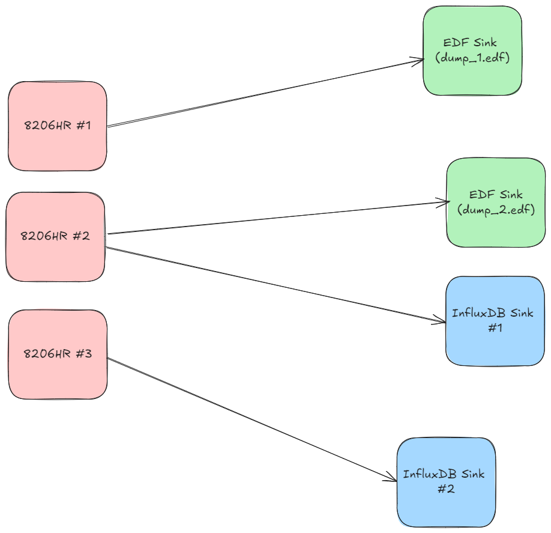

###########################################
Visualizing Data During Streams 😎
###########################################

.. TODO: You cant use commands when streaming, you have to stop streaming.

.. contents:: 

======================
The Terraform Automation 🗻
======================

If you downloaded Morelia directly from the GitHub page, you'll have access to visualize the data streamed to the ``InfluxSink`` and ``QuestSink``. 

In order to do so, you'll need to download both Terraform and Docker to create containers for both the data source (Influx or Quest) and Grafana.

The downloads can be found at the links below, or if you are on bash, you can follow ``these`` instructions to 

Streaming in Morelia takes the form of defining and executing data-flow graphs. Each data-flow
graph (in Morelia) consists of three parts:

* A collection of data **sources**.
* A collection of data **sinks**.
* A **mapping** that defines the flow of data between sources and sinks.

Let's expand on each of those concepts.

A **data source** (or more simply *source*) is anything that supplies :doc:`POD data packets </Morelia.packet.data>`. For almost all use-cases, this will be a
data acquisition device such as an 8206HR, 8401HR, or 8274D.

A **data sink** (oftentimes just called a *sink*), is a place to you want to send data. Some examples of this are EDF files, PVFS files, or even
a time-series database like InfluxDB.

We then relate sources to sinks via a one-to-many mapping with following constraint: A source can map to many sinks, but a sink can only map
to exactly **one** source. In more mathematical terms, it is an *injective* mapping.

To shed some more light on this, let us view an example data-flow graph.

This data flow graph streams data to both EDF files and InfluxDB. As you can see, each data source maps to one or more sinks, but each sink maps to only one source.
We will use this diagram as a running example as we move into the next section. 

---------------------
Infinite Streaming 🌌
---------------------

