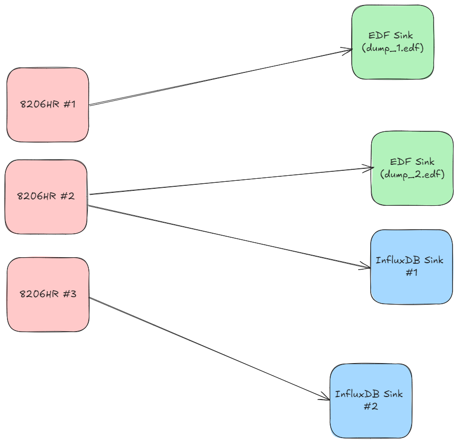

######################################
Harnessing Data Acquisition Systems 🤠
######################################

.. contents:: 

======================
The 1000-Foot View 👀
======================

Streaming in Morelia takes the form of defining and executing data-flow graphs. Each data-flow
graph (in Morelia) consists of three parts:

* A collection of data **sources**.
* A collection of data **sinks**.
* A **mapping** that defines the flow of data between sources and sinks.

Let's expand on each of those concepts.

A **data source** (or more simply *source*) is anything that supplies :doc:`POD data packets </Morelia.packet.data>`. For almost all use-cases, this will be a
data aquisition device such as an 8206HR, 8401HR, or 8274D.

A **data sink** (oftentimes just called a *sink*), is a place to you want to send data. Some examples of this are EDF files, PVFS files, or even
a time-series database like InfluxDB.

We then relate sources to sinks via a one-to-many mapping with following constraint: A source can map to many sinks, but a sink can only map
to exactly **one** source. In more mathematical terms, it is an *injective* mapping.

To shed some more light on this, let us view an example data-flow graph.

This data flow graph streams data to both EDF files and InfluxDB. As you can see, each data source maps to one or more sinks, but each sink maps to only one source.
We will use this diagram as a running example as we move into the next section. 

================================
Defining a Streaming Workflow 📐 
================================
Now, with the concepts out of the way it's time to get our hands dirty in the code. Throughout this section, we will use the diagram at the
end of the previous section as an example as we walk through how to setup a data-flow graph.

All streaming functionality is handled through the 
``Morelia.Stream`` subpackage. When streaming, the first step is to set up a data source. Great news, if you followed our :doc:`Hitchhiker's Guide to
Morelia </getting_started>`, then you already know how to do this. Any acquisition device can function as data source, so go ahead and wire up
any devices you want in the API. As an example, let's connect to three 8206HR devices,

.. code-block:: python
    
   # Import the proper class.
   from Morelia.Devices import Pod8206HR

   # Connect to an 8206HR devices on on /dev/ttyUSB0-2 and set the preamplifer gain to 10.
   pod_1 = Pod8206HR('/dev/ttyUSB0', 10)
   pod_2 = Pod8206HR('/dev/ttyUSB1', 10)
   pod_3 = Pod8206HR('/dev/ttyUSB2', 10)

The next step is to initialize our data sinks, which can be imported from the
``Morelia.Stream.sink`` subpackage. Currently, Morelia supports the following as
destinations to send data to:

=========== ======
Destination Class
=========== ======
CSV File    ``CSVSink`` 
EDF File    ``EDFSink``
InfluxDB    ``InfluxSink``
=========== ======

With plans for PVFS files in the near future. Depending on the sink, different parameters
are passed in the constructors of those objects. For specific and extensive documentation, 
on the specific parameters of each sink, please see the documentation of :doc:`Morelia.Stream.sink </Morelia.Stream.sink>`
, we will not cover it here for the sake of brevity.

Continuing along with our example, let us build our sinks.

.. code-block:: python
    
   # Import the proper class.
   from Morelia.Devices import Pod8206HR
   from Morelia.Stream.sink import EDFSink, InfluxSink

   # Connect to an 8206HR devices on on /dev/ttyUSB0-2 and set the preamplifer gain to 10.
   pod_1 = Pod8206HR('/dev/ttyUSB0', 10)
   pod_2 = Pod8206HR('/dev/ttyUSB1', 10)
   pod_3 = Pod8206HR('/dev/ttyUSB2', 10)
    
   # Create EDF sinks.
   edf_dump_1 = EDFSink('dump_1.edf', pod_1)
   edf_dump_2 = EDFSink('dump_2.edf', pod_2)

   # Create InfluxDB Sinks.
   influx_sink_1 = InfluxSink('influx.pinnaclet.com', 'supersecret', 'pinnacle', 'pinnacle', 'expirament1', pod_2)
   influx_sink_2 = InfluxSink('influx.pinnaclet.com', 'supersecret', 'pinnacle', 'pinnacle', 'expirament1', pod_3)

Finally, it's time to link them together with the mapping. We can do this using the 
``data_flow`` object from ``Morelia.Stream``. In its constructor, the ``data_flow``
object takes a single parameter, a list of tuples where each tuple contains an
acquisition device as the first element, and a list of sinks that said device maps
to as its second element. Instead of the headache of trying to parse that awful
sentence, let's see what it looks like in our example.

.. code-block:: python
    
   # Import the proper class.
   from Morelia.Devices import Pod8206HR
   from Morelia.Stream.sink import EDFSink, InfluxSink
   from Morelia.Stream import data_flow

   # Connect to an 8206HR devices on on /dev/ttyUSB0-2 and set the preamplifer gain to 10.
   pod_1 = Pod8206HR('/dev/ttyUSB0', 10)
   pod_2 = Pod8206HR('/dev/ttyUSB1', 10)
   pod_3 = Pod8206HR('/dev/ttyUSB2', 10)
    
   # Create EDF sinks.
   edf_dump_1 = EDFSink('dump_1.edf', pod_1)
   edf_dump_2 = EDFSink('dump_2.edf', pod_2)

   # Create InfluxDB sinks.
   influx_sink_1 = InfluxSink('influx.pinnaclet.com', 'supersecret', 'pinnacle', 'pinnacle', 'expirament1', pod_2)
   influx_sink_2 = InfluxSink('influx.pinnaclet.com', 'supersecret', 'pinnacle', 'pinnacle', 'expirament1', pod_3)
    
   # List that defines how sources map to sinks. 
   mapping = [ (pod_1, [edf_dump_1]),
               (pod_2, [edf_dump_2, influx_sink_1]),
               (pod_2, [influx_sink_2])]

   flowgraph = data_flow(mapping)

And presto, you are all ready to stream! In the next section, we will carry our example
over and loop at how to start collecting data now that everything is in place.

=====================
Let the Data Flow! 🌊
=====================

This section will use the example from last section, so if you are just jumping in
here, be sure to reference that first.

Once we've created our flow graph, we can start streaming! We can either stream data
for a specific time interval, or whenever we tell it to stop.

---------------------
Temporal Streaming ⏳
---------------------
The first way to stream is for a particular duration of time, using ``data_flow``'s ``collect_for_seconds`` method. This method takes one parameter, how many seconds to collect for,
and **blocks until collection has finished**. When run, this will execute the data-flow graph defined by ``data_flow``, streaming data from sources to sinks. As a short example,
to collect for 5 minutes using our example from earlier.

.. code-block:: python

   flowgraph.collect_for_seconds(5*60)

---------------------
Infinite Streaming 🌌
---------------------
The other way to stream is for an undefined amount of time. To begin streaming, use ``data_flow``'s ``collect`` method. This method takes no parameters and is **non-blocking**.
When ready to stop streaming, the ``stop_collecting``. This behavior is also supported through context managers, where you can use a ``with`` statement to automatically start
and stop streaming. For example,

.. code-block:: python

   with flowgraph:
        if flag:
            break

        # do other things...

can be used to stream until the ``flag`` variable is set to true at some other point in the code, and will automatically stop streaming once the ``with`` statement is left.

=========================
Making Your Own Sinks 📦
=========================

.. TODO: sections for making your own sinks.
.. TODO: Seperate page for "workflow examples", like influx has.
.. TODO: note on influx that sits not good for long-term storage.
