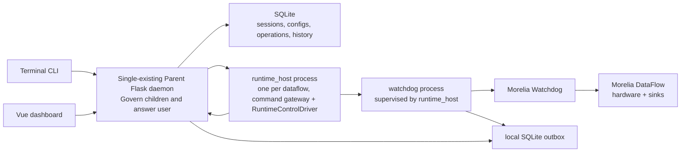

# Backend Control Plane Architecture Plan

## Status

Draft — working architecture proposal for isolating the Flask backend from the Vue frontend while preserving full terminal control.

**All-sink support (2026-07-21):** multi-sink is the shipped configuration/runtime
contract. Source→sink is **one-to-many** (`sinks[]`); CSV remains the default safe
file sink but is **not** the only production type. Operator matrix and runbook:
[`docs/sinks/support-matrix.md`](./sinks/support-matrix.md),
[`docs/sinks/operator-runbook.md`](./sinks/operator-runbook.md). Packet graph:
[`docs/sinks/README.md`](./sinks/README.md). Historical design/gap authority:
[`docs/all-sink-support-design-and-gap-audit.md`](./all-sink-support-design-and-gap-audit.md).

## Date

Created: 2026-06-23
Review: 2026-06-25 - talked about TOML file device-template system
All-sink overlay: 2026-07-21 (packets 00–30)

## Context

The current backend was originally shaped around serving the dashboard frontend. That makes the frontend the practical control surface, even though the backend is the part that should own experiment state, device ownership, watchdog orchestration, scheduling, recovery history, and operational safety.

The target system needs two equal control surfaces:

- Vue dashboard for guided operation.
- Terminal CLI for power users, automation, debugging, and headless operation.

Both control surfaces should drive the same backend capability set. The CLI must not become a second independent implementation that bypasses backend safety rules.

Inputs considered:

- Dashboard requirements from the frontend `guarded-experiment-dashboard.md` product spec.
- Existing Flask backend structure.
- Existing `docs/watchdog-http-v1.md` contract.
- Existing TOML configuration workflow as inspiration only.
- Existing Morelia Watchdog behavior, which should be kept and utilized.

## Core decision

Build the backend as a local control plane, not as a frontend helper - this help separate the interface for normal user with frontend UI and power user prefer CLI option.

The Flask app remains the HTTP/API server, but business logic moves into application services that can be called by both REST routes and a CLI. Hardware/runtime execution moves into a three-process split: a `runtime_host` process per owned dataflow, and a supervised watchdog process underneath it that wraps the existing Morelia Watchdog. `runtime_host` stays the command gateway and exposes the localhost command/status interface to the control plane; the watchdog process owns Morelia, serial ports, DataFlow, and sinks, and reports telemetry directly to the control plane (via a local SQLite outbox) rather than only relaying through `runtime_host`. See [`docs/migration/README.md`](./migration/README.md) for the full identity model (`runtime_id`, `watchdog_id`) and the packet-by-packet migration from the current two-process path.



## Behavioral contract

These are expected behaviors, not implementation details:

- Exactly one local control-plane daemon may own hardware on a machine. A second
  hardware-owning daemon must fail closed, and Flask's debug reloader must never
  start hardware-owning code twice.
- There are two HTTP boundaries that must not be conflated:
  - North boundary: Vue dashboard and CLI call the Flask control-plane API.
  - South boundary: the Flask control plane calls runtime-agent localhost
    command/status endpoints.
- The CLI never talks directly to runtime agents for state-changing work.
- One runtime agent owns one dataflow. One dataflow may contain multiple
  device-to-sink streams.
- Commands affecting the whole dataflow are ONLY `start` and `stop`. Recovery commands
  (`reconnect`, `restart`, `reset-stream`) target exactly one stream and require
  both a `target_device_id` and a `recovery_id`.
- Session lifecycle is `draft -> scheduled -> starting -> active -> ending ->
  completed`. Start is allowed only from pre-start states; destructive changes
  are allowed only before a session starts unless an explicit operator workflow
  says otherwise.
- Runtime phase is separate from health: `idle`, `preflight`, `running`,
  `stopped`, and `closed` describe collection lifecycle only.
- Stream status (health from source to sink) is separate from reachability. Stream status is
  `healthy/suspect/unhealthy`; comms status (health of the watchdog driver) is
  `current/delayed/unreachable/stopped`. A bad stream does not mean the runtime
  agent is unreachable.
- `suspect` starts the confirmation window and the recovery episode time range.
  It should be recorded, but it should not become an operator-facing action (user will not see it)
  until it either resolves to healthy or confirms as unhealthy.
- Every recovery episode records time range, reason, actions, policy version,
  output segment boundary/gap, and outcome. The `recovery_id` rides every report
  in the episode, including the closing healthy report.
- Both `Automate` and honest `Recommend` are v1 behavior. In `Automate`, the
  watchdog may recover automatically. In `Recommend`, the watchdog reports and
  waits for an explicit guarded command.
- If the daemon is unavailable, runtime/session state-changing CLI commands fail
  with a clear daemon-unavailable error instead of mutating SQLite or touching
  hardware offline.

## Required separation of responsibilities

### Control plane

The backend control plane owns:

- Session lifecycle and state machine.
- Device and dataflow ownership.
- Reusable device templates, port-bound device configs, session configs, and
  immutable runtime manifests (see *Revised device/ownership model, 2026-06-30*).
- Operation queue/state tracking.
- Process supervision for runtime agents.
- REST API and SSE/event replay for the dashboard.
- CLI-facing service calls.
- Startup reconciliation after backend restart.
- Persistent incidents, gaps, recovery outcomes, policy changes, and notes.

The control plane must not directly run long-lived hardware collection inside Flask request handlers.

### Runtime agent

The runtime agent owns:

- Constructing Morelia devices, sinks, dataflows, and watchdog objects from an immutable manifest.
- Calling the Morelia Watchdog lifecycle in the required order:
  1. create devices/sinks/dataflow,
  2. construct watchdog,
  3. `watchdog.preflight()`,
  4. `flowgraph.collect()`,
  5. `watchdog.run()`,
  6. `watchdog.close()` in cleanup.
- Hosting localhost-only command/status endpoints for the control plane.
- Enforcing one in-flight lifecycle command per runtime.
- Reporting status and recovery events back to the control plane.

### CLI

The CLI is a first-class client, but it should normally call the same backend control plane API used by the frontend. It should not independently write SQLite or touch hardware while the daemon is running.

Allowed offline CLI functions:

- Validate device-config / session-config files.
- Diff two device-template TOML artifacts.
- Print local diagnostics.
- Generate runtime manifests for inspection only.

State-changing CLI functions should go through the daemon:

- Create / edit / rename / delete device templates (they mutate the SQLite
  authority; DB-stored references link by id, while external TOML references by
  name may become stale after rename/delete and should fail clearly on import).
  (Editing is in-place — templates are mutable as of 2026-06-30; no `clone`.)
- Export a device template from a current device config or active manifest
  snapshot; export a session template from a current session config or active
  manifest snapshot.
- Create / edit / delete port-bound device configs; claim/release them to the
  device pool by attaching/detaching sessions.
- Create/start/stop sessions.
- Reconnect/restart/reset streams.
- Attach/detach shared dataflows.
- Change policies.
- Acknowledge incidents.
- Run schedules.

## Device discovery and Device List

Device discovery is a control-plane service, not a long-lived Watchdog job.

The control plane owns a `DeviceDiscoveryService` that runs short-lived,
read-only scans through typed discovery providers. For v1, the provider is
`pod8206hr` discovery backed by Morelia `pod_scan.detect_pod_devices`. The scan
reports hardware; it must not create devices for collection, construct a
Watchdog, start a DataFlow, or hold serial ports after the scan returns.

The runtime agent and Morelia Watchdog only work from an immutable manifest once
a session starts. During recovery, Watchdog may check whether a known manifest
port is present/openable, but it does not own the general Device List.

Device List behavior:

- `pinnacle device list` and the frontend Device List both call the daemon API.
- Discovery scans are on-demand or workflow-triggered in v1, not routine
  background polling. Run scans when the CLI lists devices, the frontend Device
  List opens or refreshes, guided device-config creation needs bindable hardware,
  or session preflight/start needs fresh targeted evidence. A daemon startup scan
  may warm the cache, but there is no always-on scanner in the first production
  slice.
- The daemon may cache recent scan results for responsive UI/CLI reads. A short
  TTL, such as 5-15 seconds, is acceptable for Device List display; manual
  refresh and session preflight/start bypass the cache and perform fresh checks.
- If a later live plug/unplug view is needed, add it as an explicit opt-in
  passive monitor that never probes ports owned by runtime agents.
- A scan returns `scan_id`, backend `scanned_at` UTC, and one row per discovered
  device.
- Each discovered row includes `type`, `port`, `hardware_id` or serial when
  available, display label, and availability.
- Availability is latest discovery evidence, separate from pool ownership
  `status`. It is one of:
  - `available` — the scan sees the device and it appears openable.
  - `unopenable` — the scan sees the device/port, but it cannot be opened or
    verified for use.
  - `not_found` — a persisted device config exists, but the latest scan did not
    find the physical device.
- Status is control-plane pool ownership, separate from discovery evidence. It
  is one of:
  - `free` — a persisted device config exists and no responsible session
    currently claims it; a new session may claim it if availability permits.
  - `claimed` — a responsible session owns the device through a dataflow/runtime;
    the claim remains until that session completes, fails, is deleted, or an
    explicit operator recovery/release workflow resolves it.
- If the control plane already owns a device, the row includes the owning
  `session_id`, `dataflow_id`, and runtime identity.
- No attached hardware is an empty list, not an error.
- Per-port scan errors are returned as warnings on the affected row; a scan-wide
  failure returns a typed control-plane error.
- The control plane may persist `physical_device` / `device_seen` rows with
  `first_seen_at`, `last_seen_at`, `last_checked_at`, last known port, type, and
  hardware ID. These records help the UI show history, but they are not
  ownership by themselves.
- `first_seen_at` is immutable UTC discovery evidence: the first backend scan
  that positively identified a physical device. `last_seen_at` is the most recent
  backend scan that positively saw the same physical device. `last_checked_at` is
  the most recent scan where the control plane considered or searched for that
  device, including negative results.
- Update `last_seen_at` only for positive evidence such as `available` or
  `unopenable`. Do not update `last_seen_at` for `not_found`; update
  `last_checked_at` and current availability instead.
- (2026-06-30) A discovered device can be promoted into a persisted **device
  config** (port + params), keyed by `device_type + hardware_id`. `device list`
  then shows its pool **status** (`free` / `claimed` by a session) alongside the
  discovery availability. See *Revised device/ownership model*.

Initial persisted shape for discovery-aware device config rows:

```text
device_config
- id
- device_type
- hardware_id
- port
- parameters
- nickname
- source_template/provenance
- claim_state
- last_seen_at
- last_checked_at
- last_availability
- created_at
- updated_at
- unique(device_type, hardware_id)
```

Initial persisted shape for per-scan evidence rows:

```text
device_seen
- id
- physical_device_id (resolved from device_type + hardware_id; usually the same
  physical identity used by the device config)
- scan_id
- seen_at
- port
- availability
- display_label
- warnings_json
- raw_json
```

## Template TOML library and access

> Terminology revised 2026-06-30: the "device template" library described here is
> the **device template** library; rows are **mutable** (edit-in-place), not
> immutable revisions. See *Revised device/ownership model*.

Device template TOML files are import/export artifacts. The SQLite device-template
library is the authority.

When a user imports or creates a device template:

- Validate through the typed registry.
- Store one mutable `device_template` row with `id`, unique `name`, `type`,
  `schema_version`, canonical JSON `content`, `content_hash`, and backend
  `created_at` UTC.
- Preserve `source_format`, `source_filename`, and original TOML text when
  provided so users can audit what was imported. Canonical export still comes
  from validated SQLite content.
- Never overwrite a *different* template by saving the same name; auto-suffix the
  new row name unless the user performs an explicit rename.
- Editing template content updates the row **in place** (revised 2026-06-30 —
  mutable; previously this created a new row). `content_hash` is recomputed for
  drift detection; the immutable record of what ran lives in the runtime manifest.
  Rename changes the label only and records `renamed_at` / `previous_name` audit
  metadata if implemented.
- Template List reads from SQLite, not from arbitrary folders on disk.
- Users access templates through `pinnacle device template list/show/edit/export`,
  frontend Template List, and session composition forms.
- `pinnacle device template export <device-id-or-nickname> <output-name>` saves the
  current settings from a concrete device config as a reusable device template.
  If the device is free, export reads the persisted `device_config.parameters`.
  If the device is claimed/running, export reads the active runtime-manifest
  snapshot for that device so the artifact represents what is actually running.
- Rename/delete must call `references(name)` first and return the sessions that
  reference that name so the UI/CLI can warn before the next start fails.

## Configuration model

Use TOML as an import/export format, not as the internal authority.

Recommended flow:

```text
Device template TOML   ─┐   (reusable per-device parameters)
Session config TOML  ─┘   (composition: bound devices + sinks + policy)
  -> typed validation (device/sink registry; closed parameter schema)
  -> mutable, name-keyed device templates + session config in SQLite
  -> resolve at session start: snapshot referenced device configs by identity
  -> immutable runtime manifest (hashed)
  -> runtime-agent device/sink factory
```

Key rules:

- Store canonical validated config in SQLite.
- Preserve original TOML text and source metadata when provided for audit/export.
- Assign every device template a schema version and content hash.
- Do not let runtime agents reread arbitrary user TOML paths.
- Do not accept arbitrary Python class paths from config.
- Use a typed driver registry for supported devices and sinks.

Resolved v1 shape:

- First production device type is `pod8206hr` (also `pod8401hr`).
- **Initial vertical slice** used a managed safe `csv` sink. **Current shipped
  sink set** (all-sink packets): `csv`, `edf`, `pvfs`, `influx`, `quest`, `plot`
  — see [`docs/sinks/support-matrix.md`](./sinks/support-matrix.md). Sessions
  compose an ordered `sinks[]` per source (one-to-many). Legacy single
  `sink_type`/`sink_location` remains a read-normalized compatibility path only.
- **Device templates** are reusable parameter sets only (no physical binding,
  sinks, or nicknames). **Device configs** (revised 2026-06-30) are port-bound
  device instances built from a template snapshot or manual entry; identity is
  `device_type + hardware_id`.
- Session configs compose **device configs**, assign **one or more sinks**, choose policy, and
  resolve to an immutable runtime manifest at start.
- Editing a template updates it in place (mutable, revised 2026-06-30); editing a
  device config is allowed only while it is free. Running manifests never change
  because a template or config was edited later — the manifest is a snapshot.
- Stored session-template and device-config links use `device_template_id` so
  template renames do not break DB-owned references. Exported TOML references the
  template by name and can go stale after rename/delete; import must fail clearly
  when the named template no longer exists.

Example internal entities:

- `device_template` (was `device_config`) — reusable, name-keyed, **mutable**
  parameter set (params only: gains, filters, TTL). Names are unique; saving a new
  one over an existing name auto-suffixes. Rows carry schema version, content
  hash, created_at UTC, and optional original TOML source metadata.
- `device_config` (NEW, port-bound) — a physical device instance: `device_type`,
  `hardware_id`, `port`, snapshot `parameters`, optional `nickname`, optional
  `source_template` provenance, and a `claim` state (free / claimed-by-session).
  Unique key `device_type + hardware_id`.
- `session_config` — composition: references one or more **device configs** + a
  sink (type/location) per device + the policy. (Whether the reference is direct
  or via a dataflow grouping is an open decision — see below.)
- `physical_device` / `device_seen` — discovered hardware history (port,
  hardware id, type, first_seen_at, last_seen_at, last_checked_at) from Device
  List scans.
- `runtime_manifest` — immutable, hashed snapshot resolved at session start; the only
  thing a runtime agent builds from.

Sinks are not reusable templates; they are assigned per device inside a session
config (type + location). The location is **required at the session/composition
layer** — any dataflow that runs produces output and needs a save path; the
registry stays permissive but the session layer enforces it (see *Monitoring: the
unified subscriber model*, "sink_location is required").

## Revised device/ownership model (2026-06-30)

> This section supersedes the two-tier framing above where they conflict. The
> earlier text used "device config" for the reusable parameter set; that concept
> is now **device template**, and "device config" is promoted to a new,
> port-bound entity. Three tiers:

```text
device template          device config                  session
(reusable params,    →   (a physical device:       →   (composes device configs
 NO port, a library)      port + params, persisted)     via device_flows + sinks)
```

### device template (was "device config")
- Reusable, named parameter set (gains, filters, TTL). **No port.**
- **Mutable** (revised): editing updates the row **in place** — it no longer
  forks a new revision. Create-new and delete-if-unused still allowed.
- `content_hash` is retained for drift detection; the immutable record of what a
  session actually ran lives in the **runtime manifest**, not the template.
- CRUD via `pinnacle device template list/show/edit/export`, frontend Template
  List, and session-composition forms.

### device config (NEW — port-bound device instance)
- A specific physical device made runnable: `device_type`, `hardware_id` (read
  from hardware), `port` (an attribute, **not** identity), `parameters`,
  optional `nickname`.
- **Identity = `device_type` + `hardware_id`** (e.g. `8206-300`) — unique. One
  physical device = one device config. `hardware_id` is treated as an **opaque
  string** (exact format TBD until validated on hardware).
- Built two ways: `pinnacle device config` (interactive prompts) or
  `device config --template <TOML | template list-number>` (**snapshot-copies**
  the template's params; later template edits do not change it).
- `pinnacle device edit <id>` edits params (allowed **only while free** — not
  owned/running). On edit it prompts **"update the source template too?"**:
  yes → also writes the (now-mutable) template; no → the config becomes
  **custom** (template link severed; provenance label "was `<template>`" retained
  for history). `pinnacle device template export <device-id-or-nickname> <output-name>`
  saves the current device settings as a new reusable template.

### device constructor parameter reference (Morelia)

Source of truth for what each supported POD model needs to construct. The keys
are Morelia device **model numbers**; the registry (`app/services/registry.py`)
validates against these. Two categories share this table and must be kept
distinct in our data model:

- **Session-binding / construction-only transport** — `port`, `baudrate`,
  `device_name`, `use_d2xx`. These are **not** device-template/config
  parameters; they are supplied per run at session start (`port` is a device
  config *attribute*, not an identity or a template param).
- **Reusable device parameters** — `preamp_gain`, `sample_rate`, `ss_gain`,
  `preamp`, `primary_channel_modes`, `secondary_channel_modes`. These belong in
  device-template/device-config `parameters` and are snapshotted into the
  runtime manifest.

| Model # | `device_type` | class | required | notable defaults / validation |
|--------:|---------------|-------|----------|-------------------------------|
| 46 | POD8274D | `Pod8274D` | `port` | `baudrate=921600`, `device_name=None` |
| 48 | POD8206HR | `Pod8206HR` | `port`, `preamp_gain` | `baudrate=9600`, `sample_rate=None`, `use_d2xx=False`; **`preamp_gain ∈ {10, 100}`** |
| 49 | POD8401HR | `Pod8401HR` | `port`, `preamp`, `primary_channel_modes`, `secondary_channel_modes` | `ss_gain=(None,)*4`, `preamp_gain=(None,)*4`, `baudrate=9600`, `use_d2xx=False` |
| 50 | POD8480SC | `Pod8480SC` | `port` | `baudrate=9600`, `device_name=None` |
| 52 | POD8229 | `Pod8229` | `port` | `baudrate=19200`, `device_name=None` |

```python
DEVICE_CONSTRUCTOR_PARAMS = {
    46: {
        "device_type": "POD8274D",
        "class_name": "Pod8274D",
        "required": ["port"],
        "defaults": {
            "baudrate": 921600,
            "device_name": None,
        },
    },
    48: {
        "device_type": "POD8206HR",
        "class_name": "Pod8206HR",
        "required": ["port", "preamp_gain"],
        "defaults": {
            "baudrate": 9600,
            "device_name": None,
            "use_d2xx": False,
            "sample_rate": None,
        },
        "validation": {
            "preamp_gain": [10, 100],
        },
    },
    49: {
        "device_type": "POD8401HR",
        "class_name": "Pod8401HR",
        "required": [
            "port",
            "preamp",
            "primary_channel_modes",
            "secondary_channel_modes",
        ],
        "defaults": {
            "ss_gain": (None, None, None, None),
            "preamp_gain": (None, None, None, None),
            "baudrate": 9600,
            "device_name": None,
            "use_d2xx": False,
        },
    },
    50: {
        "device_type": "POD8480SC",
        "class_name": "Pod8480SC",
        "required": ["port"],
        "defaults": {
            "baudrate": 9600,
            "device_name": None,
        },
    },
    52: {
        "device_type": "POD8229",
        "class_name": "Pod8229",
        "required": ["port"],
        "defaults": {
            "baudrate": 19200,
            "device_name": None,
        },
    },
}
```

### session creation and session template export
- `pinnacle session create` is the normal guided create flow. It prompts the user
  to choose from existing free device configs, assign sinks, choose policy, and
  confirm the resulting session config before the CLI sends it to the daemon.
- `pinnacle session create --template <template-name | template-number | file>`
  creates a new session by snapshot-copying a reusable session template. The user
  may still be prompted to resolve environment-specific choices such as current
  device configs, sink destinations, or policy overrides before submission.
  Later template edits do not change the created session.
- `pinnacle session template export <session-id> <export-name-or-path>` saves a
  reusable session template from an existing session. If the session has not
  started, export reads the persisted session config. If the session is active or
  completed, export reads the runtime-manifest snapshot so the artifact represents
  what actually ran.
- Export never writes machine-local `device_config_id`, `hardware_id`, or `port`
  into the reusable session-template artifact. For each device flow it resolves
  the session's local `device_config_id` back to a reusable device template and
  writes that device template's **name** to TOML.
- If a device config has no reusable source template, or has diverged from its
  source and must be reproduced exactly, export creates/uses a device template
  from the config's current params. The default generated name is
  `{device_type}-{session_slug}-{flow_label}-{params_hash8}` where `flow_label`
  is the flow nickname when present, otherwise `flow-XX`, and `params_hash8` is
  derived from canonical reusable content (`device_type`, schema version, params),
  not `hardware_id`, `port`, sink location, or session id. Name collisions append
  `-2`, `-3`, etc.
- Session template export includes composition settings: device selections,
  sinks, policy, and dataflow grouping. It excludes transient runtime state such
  as operation IDs, runtime host ports/tokens, incidents, output segment IDs, and
  recovery history.

### Dataflows, ownership, the device pool, and monitoring
- A **dataflow** is the unit a session *drives*: it groups **multiple device
  sources + their sinks** and is owned by exactly one **responsible session** (one
  runtime agent per dataflow, matching the behavioral contract above). A session
  composes its driven devices into its dataflow.
- A device config is **driven within exactly one dataflow at a time**; the
  responsible session holds its **claim** (route this through the existing
  runtime-ownership concept, not a new lock). When that session **completes /
  fails / is deleted**, the device is **released to the free pool** — unbound, any
  session may claim it. `pinnacle device list` shows each device's **status:
  `free` / `claimed`** (with the owning session) — a queryable column, not a
  separate command.
- **Monitoring is per-device and crosses dataflows.** A session can take data from
  **individual devices that live in *other* sessions' dataflows** by extracting
  that one device's report and **mirroring** it (live fan-out into the monitoring
  session's own sink). A monitor does **not** drive or claim the device, and a
  monitoring session can **aggregate device-mirrors from several different
  dataflows** — its composition is a set of per-device mirror subscriptions, not a
  single foreign dataflow.

### New runtime requirement (reaches the runtime/output layers)
> Resolved by *Monitoring: the unified subscriber model (2026-07-02)* — the
> "mirror" framing below is superseded by Producer/Consumer subscriptions
> (every session is a subscriber; monitoring = a foreign subscription). The
> publisher→subscriber-list seam requirement stands.

- The stream must be **publish-subscribe at per-device-report granularity** from
  the start: each device's report inside a multi-device dataflow can be
  **independently subscribed and mirrored** — one driver sink + N monitor mirrors
  **per device**, where mirrors may belong to other sessions. Even shipping with
  zero monitors, model each device stream as one publisher with a subscriber list,
  so per-device cross-dataflow mirroring is not a later runtime rewrite.

## Device config — resolved scope (2026-07-02)

> This section is authoritative for everything device-config-related and
> **supersedes conflicting earlier text**, specifically: the claim-routing note
> under *Dataflows, ownership...* ("route through runtime-ownership, not a new
> lock"), the `content_hash`-for-drift framing, and any implication that a
> session composes devices from **templates** inline. It closes the gaps found
> when the model/service/migration were traced end to end and the composition
> tier was found to bypass `device_config` entirely.

### A. Session ↔ device binding (the load-bearing seam)
- A session composes **device configs**, not templates. Each
  `Session.device_flows` entry references a persisted `device_config` by id:
  ```text
  device_flows entry
  - device_config_id     # FK -> device_configs.id  (replaces inline device_template/hardware_id/port)
  - sink_type
  - sink_location        # optional; segment allocator assigns when absent
  - nickname             # optional, display only
  ```
- **Manifest resolution snapshots the CONFIG**, not the template: at session
  start the resolver reads `device_config.parameters` and `device_config.port`
  and freezes them into the immutable runtime manifest. Custom edits to a config
  are therefore honored at run time; template edits never leak into a run.
- Refactor required: `session_config.py` (`_ENTRY_FIELDS`, `validate_entry`) and
  `manifests._build_manifest` currently resolve `device_template` name +
  `hardware_id` + `port`. They must resolve `device_config_id` instead.

### H. Single source of truth for `port`
- `port` lives **only** on `device_config`. It is removed from the session
  `device_flows` entry (falls out of A). The manifest takes the port from the
  config at resolve time.

### C. Physical identity
- Identity stays the composite **`device_type + hardware_id`** (unique). Rationale:
  two different physical devices can rarely share a serial across models, so the
  serial alone is not safe as the key. `device_type_by_hardware_id()` keeps
  dropping serials that map to >1 type as genuinely ambiguous.
- **`hardware_id` format (resolved 2026-07-02):** `^[0-9A-Za-z]{5}$` — exactly 5
  alphanumeric chars. Validated on `device_config` create/`create_from_template`
  (reject non-matching with a typed error); stored and compared **case-sensitive,
  exact** (matches the reported FTDI serial). `device_seen` records the raw
  scanned serial even if it falls outside the pattern — that is discovery
  evidence, not an identity claim.

### B. Claim authority and stealable pre-start reservations
- `device_config.claim_state` (`free`/`claimed`) + `claimed_session_id` are the
  **pool-reservation authority** — a projection of session lifecycle. Set
  `CLAIMED` at attach (pre-start), `FREE` on session complete/fail/delete.
- `runtime_ownership` remains the **process-liveness authority**. Startup
  reconciliation joins the two: a config `CLAIMED` by a terminal session with no
  live runtime is auto-released.
- **Soft vs hard claim** — the single predicate "does the owner have a live
  `runtime_ownership` row?":
  - *soft* (owner still `draft`/`scheduled`, no runtime) → **stealable with
    confirmation**.
  - *hard* (live/starting runtime holding the port) → not stealable; use the
    stop/recovery/release workflow.
- `claim(config_id, session_id, *, force=False)`:
  ```text
  FREE                         -> claim
  CLAIMED by same session      -> no-op (idempotent)
  CLAIMED by other, hard claim  -> raise DeviceConfigNotFree
  CLAIMED by other, soft claim  -> raise DeviceClaimConflict(current_session, stealable=True)
                                   unless force=True -> atomic release(old) + claim(new)
  ```
- The steal is **sugar over an atomic `release(old)+claim(new)`** guarded by the
  soft/hard check — not a new state path. The CLI/UI catches
  `DeviceClaimConflict` and prompts *"Device reserved by session X (not started).
  Switch to this session?"*, retrying with `force=True`. New typed error:
  `DeviceClaimConflict(config_id, current_session_id, stealable=True)`.

### D. Template provenance and drift (no new column)
- Drift is a **live comparison**, not stored state, and is **library-hygiene
  only** — since A snapshots the config, template drift can never affect a run:
  ```text
  drifted = config.source_template_id is not None
            and template(config.source_template_id).parameters != config.parameters
  ```
- No `source_template_hash` / version column. Template `content_hash` is retained
  for template-library dedup/audit, **not** for config drift.

### K. Rename-safe template link (link by id, cache the name)
- Add `source_template_id` (nullable FK -> `device_templates.id`,
  `ON DELETE SET NULL`). Keep `source_template` as a display/breadcrumb cache.
  - Template **rename** → link survives (id is stable); refresh cached name lazily.
  - Template **delete** → FK auto-nulls the id → config becomes *custom*
    automatically; `source_template_history` preserves the "was `<name>`"
    breadcrumb (soft-sever, already implemented — see J).
- `edit(update_source_template=True)` must write back by **id**, not name, so a
  post-snapshot rename/delete no longer raises `DeviceTemplateNotFound`.

### J. Edit-sever is resolved (soft-sever, implemented)
- Declining "update the source template too?" **soft-severs**: live link nulled,
  old name kept in `source_template_history`. Already coded in
  `device_configs.edit` (Option C). Removed from Open Decisions.

### I. Registry coverage — no crash on known types
- The registry must carry a schema entry for every `DeviceType` so
  `pod8229 / pod8274d / pod8401hr / pod8480sc` no longer hit an uncaught
  `KeyError` at `_SCHEMA[device_type]`. Each entry's **writable-param schema is
  TBD from the Morelia property maps** (the `DEVICE_CONSTRUCTOR_PARAMS` table
  holds only *construction* params, not settable ones). Until a type's schema is
  pinned, its entry raises a typed `UnsupportedDeviceType` rather than crashing.

### E. `device_seen` persistence (no `physical_device` table)
- `discovery.scan()` currently persists nothing. Add a `device_seen` model and
  write one row per discovered device per scan. **No `physical_device` table.**
  ```text
  device_seen
  - id
  - physical_device_id   # synthetic "{device_type}:{hardware_id}" derived from the SCAN row
  - scan_id
  - seen_at
  - port
  - availability         # available | unopenable | not_found  (F)
  - display_label
  - warnings_json
  - raw_json
  ```
- `physical_device_id` is a derived **string**, not an FK — it is populated even
  for devices with no `device_config`, and equals a config's identity when one
  exists (that is the Device-List join key). For unopenable scans with no
  serial it degrades to `unknown:<serial-or-empty>`.

### F. Availability vocabulary (doc is canon; code must align)
- Canonical availability values: **`available` / `unopenable` / `not_found`**.

### G. Device List join
- The Device List is a **full-outer join of persisted `device_config` rows and
  the latest scan**, keyed on `(device_type, hardware_id)`. The UNKNOWN-type
  enrichment (`_apply_configured_device_types`) must run **before** the join so
  unopenable-but-configured devices match their config.
- `status` is control-plane pool state, defined **only for configured devices**:

  | Case | status | availability | row means |
  |---|---|---|---|
  | config **and** scan | `free`/`claimed` (+owner) | `available`/`unopenable` | configured + present; warn if `config.port != scan.port` |
  | config only, absent from scan | `free`/`claimed` | `not_found` | configured but unplugged |
  | scan only, no config | `unconfigured` (N/A) | `available`/`unopenable` | present, unconfigured; UI offers "create device config" |

- Scan-only rows render as `unconfigured` because no pool record exists yet.

### Resolved persisted shape for `device_config`
```text
device_config
- id
- device_type
- hardware_id
- port                     # authoritative port (H)
- parameters               # canonical, validated snapshot
- nickname
- source_template          # cached display name (K)
- source_template_id       # NEW: FK -> device_templates.id, ON DELETE SET NULL (K)
- source_template_history  # "was <name>" breadcrumb after soft-sever (J)
- claim_state              # free | claimed (B)
- claimed_session_id       # FK -> sessions.id, null when free (B)
- created_at
- updated_at
- unique(device_type, hardware_id)   # (C)
```
Deltas vs current code/migration: add `source_template_id` (FK, migration
needed). Discovery columns (`last_seen_at`/`last_checked_at`/`last_availability`)
stay **off** `device_config` — that evidence lives in `device_seen` and the
current view is computed by the G join.

## Config artifacts and creation flows (resolved 2026-07-02)

> Resolves the Open Decision "exact device-config and session-config TOML
> formats." Complements *Device config — resolved scope* (decision A stands: a
> session **instance** binds device configs and the manifest snapshots them).

### Reusable TOML artifacts vs machine-local instances
- **Two reusable, portable TOML artifacts:**
  - **device template** — reusable params only (no port, no `hardware_id`).
  - **session template** — reusable composition: which **device template(s)**,
    optional per-device **nickname**, and which **sink type** pairs with which
    device. No physical binding.
- **Two machine-local instances** (created, never authored as reusable TOML):
  - **device config** — port-bound device instance
    (`device_type` + `hardware_id` + `port` + params).
  - **session** — running composition of **device configs**.
- **There is no device-config TOML.** A device config is *created* (flows below),
  not imported as a reusable file; exporting a device config's settings produces a
  **device template** (`pinnacle device template export <device-id-or-nickname> <output-name>`).
- **Portability and rename safety:** a DB-stored **session template** references
  `device_template_id` so device-template renames do not break stored templates.
  Exported/imported session-template TOML references device templates by **name**
  because ids are machine-local and not portable. A runnable **session instance**
  binds `device_config_id`. Instantiating a session template resolves:
  TOML name → local `device_template_id` → local `device_config_id` (Flow 2).

### Creation flows
- **Flow 1 — `pinnacle session create` (guided questionnaire).** Chooses **only
  from already-configured device configs**; the user pairs each with a **sink
  ("DB") type** and a **save location**. **It does not configure devices** — to
  add one the user runs `pinnacle device config` first.
- **Flow 2 — `pinnacle session create --template <session-template>`.** The
  **only** path that may reference an **unconfigured** device: the system
  **auto-configures** it (creates a device config from the referenced device
  template) while instantiating the session.
- **Flow 3 — session-template origin, nickname changed later.** Prompt the user to
  **save the change back to the template or ignore it** — the same
  save-back-or-diverge prompt used for device-config param edits (see J/K).

### Nickname
- Device templates do **not** contain nicknames. Nicknames live on device configs
  and session-template/session flows as display labels. Flow 1 can default from
  the chosen device config's nickname; Flow 2 can default from the session
  template's per-flow nickname; Flow 3 reconciles a later session-flow nickname
  change via the save-back-or-ignore prompt.

## Monitoring: the unified subscriber model (2026-07-02)

> Supersedes the *Dataflows, ownership... and monitoring* and *New runtime
> requirement* subsections above where they conflict. Those framed monitoring as
> per-device "mirrors"; this is the resolved model.

### Core idea — every session is a subscriber
Split the two roles currently fused inside the dataflow host:

- **Producer** — owns the hardware (the one legal serial-port opener), runs the
  watchdog, performs recovery, and **publishes** each owned device's decoded
  report stream. One publisher per owned device.
- **Consumer (subscriber)** — receives report streams and writes them to **its
  own** sinks, with its own segments and gap records.

The rule:

> **Every session is a Consumer.** A session that owns devices *also* runs a
> Producer for them. **Monitoring is just a Consumer subscribing to a Producer it
> does not own.**

There is no "monitor" entity. A monitor is a **subscription edge**
`(session → device publisher)`. Whether an edge is *owning* or *monitoring* is
decided by one fact: does that session own the device? Consequences that fall
out for free:

- **Symmetry** — the owner's sink and all monitors are peer subscribers; no
  session ever writes another session's files.
- **Cross-dataflow aggregation** — one session's Consumer subscribes to N
  publishers across different hosts ("one subscriber, many publishers").
- **Fail-to-start** — a monitoring subscription needs a live publisher; if no
  session is currently driving that device, the publisher does not exist and the
  subscription cannot attach → it **fails to start** (never idles/waits).
- **Uniform recovery** — the Producer publishes `recovery_id` as a stream event;
  every subscriber (owner + monitors) independently stamps its own segment
  boundary / gap. No special-casing of "echo" sinks.
- **Claim unchanged** — owning = producing = holds the claim; a monitoring
  subscription never claims (see B). A device can be `claimed` by its Producer
  while N sessions subscribe to it.

### Dispatch — owner-direct with a shared safe-sink-writer
- **Owner-direct:** the Producer writes its own sink **directly** (today's path);
  the publish/subscribe fan-out activates **only when a foreign monitor
  subscribes**. Zero hot-path overhead when there are no monitors (the v1 norm),
  and the primary capture has **no structural dependency** on the monitoring
  subsystem — a slow/failing monitor can never stall or corrupt the experiment's
  own record.
- **Shared safe-sink-writer:** both the direct write and the subscriber writes
  route through **one** output-safety module (segment allocation, exclusive
  create, no-overwrite, recovery boundaries). So owner-direct's isolation +
  pay-for-use is combined with a single, non-duplicated implementation of the
  release-blocker output-safety logic.
- Residual cost: a cheap 0→1-monitor mode switch that "turns on" the fan-out
  while the direct write continues.

### Transport and supervision
- **Daemon wires, host delivers.** The control-plane daemon *sets up* a
  subscription (hands the subscriber the Producer's loopback address + token +
  device topic) but is **not on the data path**; report bytes flow
  host→subscriber directly. The daemon stays a control plane.
- **Late-bound by device.** A subscription references the **device**
  (`source_device_config_id`), not a frozen host:port — so it re-resolves to
  whatever Producer currently drives that device and survives source
  restart/recovery.
- **Hardware-free subscriber agent.** A pure-monitor session (empty
  `device_flows`) runs a subscriber agent the control plane supervises like a
  runtime agent, minus hardware/watchdog/recovery.

### Persistence — runtime state, not template
- A monitoring subscription is a **live runtime row**, created by command, e.g.:
  ```text
  monitor_subscription
  - id
  - subscriber_session_id     # the Consumer session that owns the echo output
  - source_device_config_id   # the device to subscribe to (resolves to its live Producer)
  - sink_type
  - sink_location             # REQUIRED — the subscriber's own output (see below)
  - state                     # e.g. pending | attached | detached | failed
  - created_at
  ```
- It is **not** part of the reusable `session_config` TOML: a subscription
  depends on a device *currently transmitting*, which is live state and cannot be
  frozen into a portable template. A session acquires monitors at runtime via a
  command (`monitor <device> --into <session/sink>`), not by composition.

### sink_location is required at the composition/session layer (file sinks)

> All-sink overlay (2026-07-21): `sink_location` / `file_path` applies to **file**
> sinks (CSV/EDF/PVFS). Service (Influx/Quest) and Plot sinks **reject**
> `sink_location`. See [`docs/sinks/support-matrix.md`](./sinks/support-matrix.md).

- Any **file-sink** dataflow that runs — driven **or** monitoring — produces
  output, so it needs a real save location. `sink_location` is **required** when
  a file sink is composed. The typed registry stays permissive (it does not
  force `file_path`); the **session/composition layer** enforces the location for
  file sinks, and the output-safety allocator assigns the unique **segment within**
  that location — it does not invent the base location.

### Implementation delta this implies
- The runtime agent gets **conceptually split into Producer and Consumer**,
  connected by a per-device publisher→subscriber-list seam. Recommended phasing
  (confirm before build): ship the **publisher→subscriber-list seam in v1
  dormant** (owner is subscriber #0, list otherwise empty) so per-device
  cross-session subscription is never a later runtime rewrite, and **defer the
  monitor feature** (foreign subscription, subscriber agent, `monitor` command)
  to its own phase after the first single-session slice is safe.

## Daemon shutdown and runtime-agent supervision (resolved 2026-07-02)

> Resolves the Open Decision "intentional daemon shutdown semantics."

- **Default: leave running for reattach.** A control-plane daemon shutdown does
  **not** stop owned runtime agents; agents keep collecting and the daemon
  reattaches via startup reconciliation on restart. A routine daemon
  restart/upgrade never interrupts a healthy recording. This reuses the same
  reconciliation required for the crash case (Phase 6), not a separate path.
- **`--cascade` / `--all` for deliberate teardown.** An explicit flag on daemon
  shutdown stops every owned agent (closes hardware, ends collection) — for
  end-of-day or hardware maintenance.
- **`pinnacle session stop --force`.** Manual escape hatch: force-close a
  session's runtime when a normal stop cannot reach it (unrecoverable crash,
  stuck/orphaned agent). Force-close still follows output safety (finalize/close
  files cleanly where possible) and records the operation outcome.
- **Lease backstop — agents self-terminate after ~30 min without daemon contact.**
  An agent expects a periodic heartbeat from the daemon; if it hears nothing for
  the lease window (~30 min, configurable, generous enough to survive any normal
  daemon downtime), it assumes abandonment and shuts itself down cleanly (close
  device, finalize output). Guards against permanently-orphaned agents holding
  hardware forever. May be deferred to the reconciliation phase; the core shutdown
  behavior does not depend on it.

## Watchdog-process state authority and staleness escalation (resolved 2026-07-13)

> Resolves who may write `runtime_ownerships.watchdog_state`, and what happens
> when telemetry goes stale. Companion to *Daemon shutdown and runtime-agent
> supervision* one level down the tree: control plane ⇄ runtime agent and
> runtime agent ⇄ watchdog process have the same supervision shape (OS handle
> for crash detection, request/response channel for hang detection, adoption
> for supervisor restart).

### Write authority — single writer per fact

- `watchdog_state` records **process-lifecycle facts**. Only evidence
  originating from the runtime agent (the watchdog process's parent, holding
  the OS handle) may set them: exit code → `crashed`; local status-probe
  timeout → `uncertain`.
- Control-plane telemetry staleness (age of newest direct-ingest event) is
  **path-scoped** evidence — it cannot distinguish a hung watchdog from a
  broken reporting path. It drives `LinkStatus`, never writes `watchdog_state`
  directly, and never sets `crashed` under any circumstances. The operator
  badge (`HealthState.derive`) is where the two axes merge.
- Evidence precedence: exit code (certain) > local probe timeout
  (process-scoped) > telemetry age (path-scoped). Weaker evidence never
  overwrites a verdict from stronger evidence; it only triggers escalation
  toward obtaining stronger evidence.

### Staleness escalation ladder

When watchdog telemetry goes stale, the control plane escalates instead of
guessing:

1. Check its own OS handle on the runtime agent (`poll()` — the control plane
   spawned it). If the agent **exited**, skip to adoption (below). If alive,
   continue.
2. Send a check-on-watchdog directive southbound; the runtime agent's local
   probe result is authoritative and is written per the rules above.
3. If the runtime agent is also unresponsive: probe **3 times at 20 s
   intervals (~1 min total)** — slow on purpose; for a data-acquisition rig a
   spurious reset costs a run, a slow detection costs a minute of latency.
4. After the third failed probe, the control plane may write
   `watchdog_state = uncertain` itself, stamping provenance in
   `watchdog_exit_details` (e.g. `{"source": "control_plane_staleness"}`) so
   audit can distinguish asserted-from-weak-evidence from observed states.

### Failure/response matrix

| Watchdog telemetry | Runtime agent | Action |
| --- | --- | --- |
| fresh | responsive | nothing |
| fresh | dark | restart runtime agent, **adopt** the healthy watchdog — never kill it |
| stale | responsive | check directive; agent's local probe verdict is authoritative |
| stale | dark | 3 × 20 s probes → kill process tree, fence, respawn from manifest |

Full-reset actions are gated by policy mode: `Automate` executes them;
`Recommend` surfaces a reset recommendation and waits. Before declaring a
run's data lost, check `watchdog_outbox_path` — a hung watchdog may have
buffered everything in its outbox up to the wedge.

### Orphan-survivable spawn and adoption (required by the matrix)

- The watchdog process must be spawned so it **survives runtime-agent death**
  (no kill-on-parent-exit Job object / process group). A healthy acquisition
  must not die because its supervisor did.
- A restarted runtime agent reattaches via the ownership row: `watchdog_id`,
  `watchdog_pid`, `watchdog_token_hash`, `watchdog_outbox_path` are exactly the
  handles needed to find, authenticate, and adopt the running watchdog.
  Adoption failure falls through to the stale+dark row of the matrix.

### Fencing on respawn

`watchdog_id` is the fencing token. Every status report or state write must
carry the `watchdog_id` it describes; the repository rejects writes whose id
does not match the current row. Reset sequence: kill tree → write terminal
state + provenance → **rotate `watchdog_id`** for the replacement. Rotating
the token is what stops a late report from the dead watchdog (outbox flush,
stuck socket) from corrupting its successor's state.

## Watchdog integration decisions

Keep Morelia Watchdog, but wrap it.

Important constraints found during review:

- The existing Watchdog is an in-process Python class, not an HTTP service.
- The existing backend `HttpWatchdogAdapter` assumes a command endpoint, so a thin runtime wrapper is required.
- Watchdog already performs automatic recovery, which conflicts with a dashboard-only `Recommend` policy unless Watchdog gets a recovery-decision hook.
- Watchdog reconstruction currently depends heavily on `get_dict()` snapshots from live objects.
- Some device `get_dict()` implementations do not capture all post-construction configuration.
- Some sink implementations can overwrite/delete existing output files during reconstruction.

Required hardening before production use:

- Add a per-stream lifecycle lock covering manual commands and automatic recovery.
- Add a recovery decision hook so both v1 policy modes can be implemented
  honestly:
  - `Automate`: Watchdog may recover automatically.
  - `Recommend`: Watchdog reports the issue and waits for an explicit command.
- Add a reconstruction factory hook so runtime agents rebuild from immutable manifests, not incomplete live object snapshots.
- Add managed output segmentation so each start/recovery gets a unique output segment.
- Emit structured recovery result events that the control plane can persist.

## Output safety requirement

Output safety is a release blocker.

Rules:

- Never overwrite existing output.
- Never delete an existing output file during recovery.
- Allocate a unique logical output segment per start and per recovery.
- Persist segment metadata before the runtime opens or appends to files.
- For managed CSV sinks, the preferred recovery behavior is append-only reuse of
  the same session output path, with a new logical segment boundary.
- A segment may append to an existing managed file only if the file exists, is
  owned by the same session/sink, matches the expected schema hash, and is not
  currently owned by another runtime.
- If append safety cannot be proven, fail closed or allocate a new physical file.
- Never reconstruct a sink in a mode that truncates, overwrites, or deletes the
  existing file.
- Use exclusive output creation so collisions fail before data collection starts.
- Treat non-writable or duplicate paths as startup failures.
- Record gaps and recovery boundaries explicitly.

This is especially important because current CSV/EDF sink behavior can overwrite or remove existing files when reconstructed with the same path.

## Incident and gap history

The control plane owns incident and gap history. Runtime agents emit reports and
recovery events; the control plane stamps backend UTC time, correlates them to
sessions/operations/output segments, and persists the durable history.

Incident behavior:

- Open an incident when a stream confirms `unhealthy`, a runtime becomes
  unreachable, an operation fails or becomes `uncertain`, output safety fails, or
  an operator starts a manual recovery.
- Do not open operator-facing incidents for transient `suspect` reports that
  return to healthy inside the confirmation window. Still persist the raw event.
- Each incident records `incident_id`, `session_id`, `dataflow_id`,
  `device_id`/`sink_id` when known, `runtime_id`, `operation_id`, `recovery_id`,
  severity, reason code, policy mode and version, opened_at UTC, status
  (`open`, `acknowledged`, `resolved`), acknowledgements, notes, and outcome.
- In `Recommend`, the incident remains open and action-required until an explicit
  guarded command runs. In `Automate`, the incident may auto-resolve only after
  recovery succeeds and verification returns healthy.
- Acknowledging an incident never changes runtime state; it only records operator
  awareness. Recovery commands remain separate durable operations.

Gap and segment-boundary behavior:

- Create an `output_segment` row before each start/recovery opens or appends to
  a sink.
- On recovery, close the previous segment with the last known row/byte offset,
  sample counter, and backend UTC receipt time when available.
- Open the next segment with the new starting row/byte offset and the same
  `recovery_id`.
- Create a `recovery_gap` row linking the incident, recovery operation, previous
  segment, next segment, reason, policy, and best-known gap range.
- If exact sample continuity cannot be proven, mark the gap as `uncertain`
  rather than pretending there was no loss.
- The dashboard and CLI show incidents, segment boundaries, and gaps from SQLite
  history; they do not reconstruct this history from raw files at view time.

## Operation model

All state-changing actions should become durable operations.

Suggested operation states:

```text
queued -> claimed -> dispatched -> running -> verifying -> succeeded
                                                        -> failed
                                                        -> uncertain
```

Rules:

- Every operation has a request key and an operator-facing `operation_id`.
- Every operation is correlated with a session, dataflow, runtime, request ID,
  and one or more southbound `command_id` values.
- Only one state-changing operation may be active per dataflow.
- If the control plane restarts mid-operation, reconciliation must determine whether the runtime succeeded, failed, or is uncertain.
- Uncertain operations should require explicit operator resolution before another risky lifecycle command.

Identifier layers:

```text
Vue / CLI request  ->  control-plane operation  ->  runtime-host command
request_key            operation_id                 command_id
```

- `request_key` deduplicates or correlates a northbound user/API request.
- `operation_id` is the durable, operator-facing control-plane action ID. Users
  see it in `session start|stop|recover` responses, `session watch` events,
  incidents, and `pinnacle operation list/show`.
- `command_id` is the southbound runtime-host dispatch/correlation ID. It belongs
  to the command envelope sent to a runtime agent and appears in runtime command
  diagnostics. It may equal `operation_id` in v1, but the CLI/API should not rely
  on that long term.
- One operation can have zero, one, or many runtime commands. For example, a
  reconciliation may resolve an operation without dispatching a new command, and
  a recovery operation may produce multiple command attempts.

Startup reconciliation rules:

- On daemon boot, compare persisted runtime ownership rows with live agents by
  port, process identity when available, dataflow ID, watchdog ID, and manifest
  hash.
- If a matching live agent exists, reattach to it and do not spawn another agent.
- If the recorded agent is gone and the session should still be live, spawn a
  replacement only after the old owner is proven absent.
- If a live agent responds with the wrong dataflow, watchdog ID, or manifest
  hash, mark the runtime uncertain and require operator resolution.
- Backend restart must never produce two agents for the same dataflow.

## Suggested CLI surface

Initial commands:

```text
pinnacle start
pinnacle status                      # daemon pid/serving/url status
pinnacle shutdown [--force]          # stop the daemon; --force bypasses teardown verification
pinnacle doctor
pinnacle device list                       # discovered + persisted devices; status free|claimed

# device templates — the reusable parameter library (mutable, no clone)
pinnacle device template validate <file>
pinnacle device template import <file> [--name <name>]
pinnacle device template list
pinnacle device template show <name>
pinnacle device template edit <name>
pinnacle device template rename <name> <new-name>
pinnacle device template delete <name>
pinnacle device template export <device-id-or-nickname> <output-name>

# device configs — port-bound device instances (key: type+hardware_id)
pinnacle device config                        # interactive: prompt params, bind a port
pinnacle device config --template <TOML | template-number>     # snapshot from a template
pinnacle device edit <device-id>            # edit params (only while free); offers to update template
pinnacle device delete <device-id>

pinnacle session list                           # all sessions: running count + per-session status
pinnacle session create                         # guided prompts: choose devices, sinks, policy
pinnacle session create --template <template-name | template-number | file>
pinnacle session validate <file>                 # offline session-config validation
pinnacle session preview <file>                  # offline runtime-manifest preview
pinnacle session start <session-id> --wait [--watch=false]   # auto-attaches watch (live spectate) unless disabled
pinnacle session status <session-id> [--json]   # one-shot snapshot (prints and exits)
pinnacle session watch <session-id>             # live watchdog feed until you type `exit` (the "spectate")
pinnacle session stop <session-id> --wait
pinnacle session recover <session-id> --device <device-id> --action reconnect|restart|reset-stream --wait
pinnacle session template export <session-id> <export-name-or-path> --format toml

pinnacle operation list [--session <session-id>] [--state <state>] [--dataflow <dataflow-id>]
pinnacle operation show <operation-id>
pinnacle operation resolve <operation-id> --outcome succeeded|failed --note <text>
pinnacle incident list --session <session-id>
pinnacle incident show <incident-id>
pinnacle incident ack <incident-id> --note <text>
pinnacle gap list --session <session-id>
pinnacle runtime list
pinnacle runtime reconcile
pinnacle runtime command list [--operation <operation-id>] [--runtime <runtime-id>]
pinnacle runtime command show <command-id>
```

The CLI should be thin: argument parsing, output formatting, and calls into the same application services/API used by Flask routes. The exceptions are intentionally local lifecycle/validation helpers: `pinnacle status` checks the daemon pid file and serving URL, `pinnacle shutdown` terminates the local daemon, and `pinnacle session validate` / `pinnacle session preview` parse session artifacts offline before anything is persisted.

Session views come in three distinct shapes:

- `pinnacle session list` — **fleet overview**: how many sessions are running plus
  a table of each session's lifecycle status, health, and runtime phase. One-shot.
- `pinnacle session status <id>` — **one-shot detail snapshot** of a single
  session (lifecycle, runtime host, per-stream `StreamStatus`/`CommsStatus`,
  current operation, open incidents, last recovery/gap). Prints and exits;
  `--json` for scripts. It is a pure **read/aggregate** across `sessions` +
  `runtime_ownership` + latest stream events + `operations` + `incidents` +
  `recovery_gaps` — it introduces no new state.
- `pinnacle session watch <id>` — the **live "spectate"**: a continuously updating
  watchdog feed that stays open until the user types `exit` (or Ctrl-C). This is
  what `session start` auto-attaches unless `--watch=false`.

Per the `suspect` rule, a stream still inside its confirmation window renders as
`healthy` in both `status` and `list`, and does not flip session health to
`needs_action` until it confirms `unhealthy`.

`pinnacle operation list/show/resolve` is the operator-facing durable
control-plane surface. It is where users discover and inspect `operation_id`
values, and where unresolved `uncertain` operations are resolved by an operator.
`pinnacle runtime command list/show` is a lower-level diagnostic surface for
southbound runtime-host dispatch history keyed by `command_id`; it should be used
for debugging transport/acknowledgement behavior, not as the primary operator
workflow.

## Testing and verification gates

- Default test suite: `venv/Scripts/python.exe -m pytest -q`.
- Lint gate: `venv/Scripts/python.exe -m ruff check .`.
- Migration gate: Alembic upgrade to head and downgrade to base against a
  disposable SQLite database.
- **Verification is hardware-only (revised 2026-07-02).** The real
  `MoreliaRuntime` on a machine with attached devices is the verification gate;
  the previous "default CI must be hardware-free / `FakeRuntime`" mandate is
  dropped. The existing `FakeRuntime`/`FakeDiscoveryProvider`-based tests are
  being **retired** (decision 2026-07-02); pure-logic tests that use neither
  fakes nor hardware may remain. Passing on real hardware is what proves a change.
- Output safety and recovery policy changes must be proven on hardware before
  production use.
- Contract tests must cover strict JSON parsing, unknown-field rejection,
  unsupported protocol versions, localhost-only enforcement, timeout/unavailable
  mapping, and one in-flight command per runtime.
- Reconciliation tests must cover backend restart, live-agent reattach,
  dead-agent replacement, wrong-manifest uncertainty, and double-spawn
  prevention.

## Implementation plan

### Phase 0 — stabilize current baseline

- Fix current failing tests before large refactors.
- Fix current lint issues.
- Document that only one control-plane daemon should own hardware at a time.
- Ensure Flask debug reloader cannot accidentally double-start hardware-related code.
- Record the exact verification commands expected before each phase handoff.

### Phase 1 — extract backend application services

- Land the SQLite persistence foundation needed by services, sessions,
  operations, runtime ownership, device templates, session configs, incidents,
  output segments, and recovery gaps.
- Move business rules out of Flask route handlers.
- Create explicit service methods such as:
  - `CreateSession`
  - `StartSession`
  - `StopSession`
  - `GetSessionStatus`
  - `GetOperation`
- Replace Flask-specific `abort/current_app` usage in core logic with typed domain errors.
- Keep REST routes as adapters around services.
- Add CLI commands that call those same services through the local daemon.

### Phase 2 — typed configuration: reusable device templates + session composition

- Implement one vertical slice first: `pod8206hr` device template + managed `csv` sink.
- Add device discovery (Device List) backed by Morelia
  `pod_scan.detect_pod_devices`.
- Add a typed device/sink registry (closed parameter schema, no class paths).
- Reusable, name-keyed device templates: validation, canonicalization, hashing,
  created_at/source metadata, import, edit, diff, show/export, and
  rename/delete with reference warnings.
- Session composition: bind one-or-more device configs, each with a sink,
  resolving to an immutable runtime manifest at start (snapshot). Device templates
  seed device configs, but sessions do not run directly from mutable templates.
- Keep the old TOML workflow as inspiration only; separate physical device binding
  from reusable config templates.

### Phase 3 — add runtime-agent wrapper

- Build a runtime-agent executable that can run from a runtime manifest.
- Start with fake hardware/runtime tests.
- Add localhost-only command/status endpoints.
- Teach the control plane to spawn, stop, and reconnect to agents.
- Reuse the existing watchdog HTTP contract where possible, but make it real.

### Phase 4 — harden Watchdog integration

- Add lifecycle locking.
- Add recovery policy hook, including honest `Recommend` report-and-wait behavior.
- Add manifest-based reconstruction hook.
- Add public guarded command facade for manual restart/reconnect/reset commands.
- Emit structured recovery events.

### Phase 5 — implement safe output segmentation

- Use exclusive output creation.
- Generate unique logical output segments per start/recovery.
- Persist output metadata before opening files.
- Record incidents, recovery gaps, and segment boundaries.

### Phase 6 — durable operations and reconciliation

- Add operation persistence - adding ids between different elements to keep track
  in event of incidents:
  ```text
  Vue / CLI  ->  Control plane  ->  Dataflow runtime host
  request_key    operation_id       command_id
  ```
  Operation state is the durable control-plane command state:
  - queued: Created by the CLI/Vue/API-facing layer. The user intent is recorded,
    but the control plane has not yet taken ownership of executing it.
  - claimed: The control plane has claimed the operation. It has passed
    conflict/request_key checks and is now responsible for either dispatching it
    or marking it failed/uncertain.
  - dispatched: The control plane has sent a command to the dataflow host. The
    command has left the control plane; transport/ack handling is in progress or
    has just been accepted.
  - running: The dataflow host has accepted ownership and is actively executing
    it against the runtime/watchdog/stream.
  - verifying: The dataflow host or control plane is checking the real outcome,
    such as confirming the dataflow is running or a target stream is healthy.
  - succeeded / failed / uncertain: Terminal operation outcomes. `uncertain`
    remains blocking until operator resolution records `resolved_by`,
    `resolved_at`, and `resolution_note`.

- Add process/runtime ownership records: 
  - id: Integer database row ID for the current runtime ownership record in the control-plane persistence layer.
  - runtime_id  : String UUID/hex ID generated by the control plane to identify one runtime-host instance in the dataflow host layer.
  - session_id  : Integer foreign key to the session that owns this runtime in the control-plane domain layer.
  - dataflow_id: String logical dataflow ID identifying which dataflow this runtime controls in the runtime/dataflow layer.
  - manifest_hash: String SHA-256 hash of the immutable manifest running inside the dataflow host layer.
  - pid: Integer OS process ID of the runtime-host child process in the operating-system process layer.
  - port: Integer localhost TCP port where the runtime host serves commands/status in the southbound transport layer.
  - token: String auth token used by the control plane when calling the runtime host in the southbound transport layer.
  - state: String enum showing ownership status, such as starting, running, adopted, stopping, stopped, or uncertain, in the control-plane supervision layer.
  - started_at  : UTC datetime when the control plane spawned or first recorded the runtime in the supervision layer.
  - last_seen_at: UTC datetime when the control plane last successfully verified the runtime host in the reconciliation layer.
  - adopted_at  : UTC datetime when a restarted control plane reattached to an already-running runtime in the reconciliation layer.
  - stopped_at  : UTC datetime when the runtime was stopped or marked no longer active in the supervision layer.
  - details: JSON object for extra diagnostic/reconciliation metadata in the control-plane persistence layer

- Implement restart-time decision engine: system choose what to do in case they got disconnected mid session and have to come back to a mess.
  - Current decision matrix:
    - queued / claimed with no dispatch recorded:
      - mark failed
      - error code: interrupted_before_dispatch
      - release session.command_in_flight
    - dispatched/running/verifying start:
      - if matching runtime is live and /status.phase == "running":mark operation succeeded
      - mark session active
      otherwise:mark operation uncertain
    - dispatched/running/verifying stop:
      - if latest runtime ownership is proven stopped:mark operation succeeded
      - mark session completed
      otherwise:mark operation uncertain
    - recovery commands like reconnect, restart, reset-stream: require matching runtime status evidence
      - if matching recovery_id report shows target stream healthy:mark succeeded
      - if report explicitly shows failure:mark failed
      - if evidence is missing/incomplete:mark uncertain
  - Uncertain Behavior:
    uncertain is terminal but blocking.
    An unresolved uncertain operation has resolved_at = NULL, and create_operation() refuses the next risky command in the same conflict domain.
    Operator resolution records:
    - resolved_by
    - resolved_at
    - resolution_note
    After that, the operation remains historically uncertain, but no longer blocks new commands.
- Surface uncertain states clearly in REST, CLI, and UI.

### Phase 7 — monitoring and event replay

- Normalize runtime reports into persisted backend events.
- Stamp backend-side UTC timestamps because Watchdog report times are process-relative.
- Add SSE event IDs and replay.
- Distinguish healthy, delayed, unreachable, stopped, recovering, failed, and unknown states.

### Phase 8 — schedules, duplication, and shared dataflows

- Add manual/daily schedules after operation safety is proven.
- Add session duplication from immutable snapshots.
- Add shared dataflow supervision/ownership rules.
- Enforce owner stop confirmation and safe detach behavior.

## First production-quality slice

Do not try to implement every dashboard feature first.

Recommended first slice:

- Supported device types: `pod8206hr` **and** `pod8401hr` (revised 2026-07-02).
- One managed safe sink type: `csv`. Other sink types (e.g. EDF) are deferred
  until made output-safe — see the audit's deferred-sinks task.
- One session.
- One runtime agent.
- CLI-only create/start/watch/stop (`session start` auto-attaches `watch`).
- Both `Automate` and `Recommend` policy behavior.
- Watchdog recovery without output overwrite.
- Backend restart reconciliation.

### First-slice acceptance path (hardware lane)

The end-to-end happy path a real `pod8206hr` / `pod8401hr` must pass on attached
hardware:

```text
pinnacle start                    # start the daemon
pinnacle device list              # discover devices; note the device id (serial)
pinnacle device config 21172      # questionnaire → create a port-bound device config
pinnacle device template export <device-id-or-nickname> <output-name>
pinnacle session create           # questionnaire → compose configs + sink + policy
pinnacle session start            # start collection; AUTO-attaches `session watch`
                                  #   (opt out with --watch=false)
pinnacle session status           # runtime/stream/health for the session
pinnacle session stop             # stop collection, finalize output
```

- `session start` **auto-invokes `session watch`** by default; `--watch=false`
  disables the auto-attach.
- Two distinct `start`s: `pinnacle start` (daemon) vs `pinnacle session start`
  (collection).

Once that path is safe, add Vue controls and broader device support.

## Success criteria

- A user can create, start, watch, recover, and stop one `pod8206hr` + managed
  `csv` session from the CLI through the daemon.
- `pinnacle device list` returns a daemon-scanned Device List with scanned_at,
  port, type, hardware id, availability, and owner when applicable.
- A user can import/create a device template, see it in the Template List
  with created_at/source metadata, and export canonical TOML from a current
  device config later.
- A user can export a reusable session template from an existing session without
  carrying over runtime state, device config ids, hardware ids, ports, incidents,
  output segment IDs, or recovery history; device flows reference reusable device
  template names, creating a default-named template from config params when needed.
- The Vue dashboard and CLI reach the same backend behavior through the same
  application services.
- A recovery never overwrites or deletes prior output and always records segment
  boundaries and gaps.
- Confirmed failures create incidents; recovery boundaries create gap records;
  both are queryable through CLI/UI history.
- `Automate` self-recovers, while `Recommend` reports and waits for an explicit
  command.
- Backend restart reattaches to the correct live agent or reaches a known
  failed/uncertain state without double-spawning.
- Interrupted operations resolve to `succeeded`, `failed`, or `uncertain`, and
  uncertain operations block risky follow-up commands until explicitly resolved.
- Verification is hardware-only: the real Morelia path on attached devices is the
  gate (no hardware-free CI requirement).
- The first-slice acceptance path (`start → device list → device config → template
  export → session create → session start[+watch] → status → stop`) passes on a
  real `pod8206hr` and `pod8401hr`.

## Implementation boundaries

- Always: route state changes through application services and durable
  operations; use typed domain errors; use strict value-object parsing; stamp
  backend UTC timestamps on runtime events; preserve output by exclusive segment
  allocation.
- Ask first: public REST/CLI contract changes, new dependencies, schema changes
  after migrations have shipped, destructive cleanup tools, or broadening beyond
  the first production device/sink slice.
- Never: let runtime agents read mutable user TOML at run time, accept arbitrary
  Python class paths from config, run hardware collection in Flask request
  handlers, bypass daemon safety rules from the CLI, or allow two agents to own
  the same dataflow.

## Resolved decisions

- First production slice uses `pod8206hr` and managed safe `csv`.
- `Recommend` is required in v1, alongside `Automate`.
- SQLite remains the local embedded authority for the current architecture.
- Runtime-agent auth starts as loopback-only trust with an explicit seam for a
  per-agent token before shared-host or multi-user deployment.
- (2026-06-30) Three-tier model: **device template** (reusable params, mutable) →
  **device config** (port-bound device instance, key `device_type + hardware_id`,
  built by snapshot-from-template or manual) → **session** (composes device
  configs). Templates are mutable (edit-in-place); the runtime manifest is the
  immutable record of what ran.
- (2026-06-30) Device ownership: first session to attach is the responsible owner
  (sole lifecycle controller); others attach monitor-only via a **live stream
  fan-out**; the device returns to a **free pool** when the responsible session
  ends. The stream must be publish-subscribe capable from the start.
- (2026-06-30) Session↔device binding (resolves the earlier open fork): a session
  **drives** devices via a **dataflow** (multiple device sources + sinks, one
  responsible owner / one agent) **and** can **monitor** individual devices
  extracted from *other* dataflows (per-device mirror, dataflow-crossing). Fan-out
  is at **per-device-report** granularity; a monitoring session may aggregate
  device-mirrors from several dataflows.
- (2026-07-02) Device-config scope fully specified — see *Device config —
  resolved scope (2026-07-02)*. Highlights: sessions compose **device configs**
  by `device_config_id` (manifest snapshots the config, not the template);
  `port` lives only on `device_config`; identity stays `device_type +
  hardware_id` (serial format `^[0-9A-Za-z]{5}$`, case-sensitive exact);
  `claim_state` is the pool authority reconciled against `runtime_ownership`,
  with **stealable soft (pre-start) reservations** via `DeviceClaimConflict`
  +`force`; drift is a **live compare** (no hash column); template link becomes
  `source_template_id` FK (`ON DELETE SET NULL`) + cached name; `device_seen`
  persists per-scan evidence (no `physical_device` table); availability vocab is
  `available/unopenable/not_found`; Device List is a full-outer
  join with a `unconfigured` status for scan-only rows.
- (2026-07-02) Monitoring resolved as the **unified subscriber model** — see
  *Monitoring: the unified subscriber model (2026-07-02)*. Every session is a
  Consumer; a session owning devices also runs a Producer; **monitoring = a
  Consumer subscribing to a Producer it does not own** (a subscription edge, no
  claim, no separate "monitor" entity). Dispatch is **owner-direct with a shared
  safe-sink-writer**; the daemon wires subscriptions but stays off the data path;
  subscriptions are late-bound by device, **fail-to-start** without a live
  publisher, and persist as **runtime rows** (`monitor_subscription`), not in the
  reusable `session_config` TOML. `sink_location` is required at the composition
  layer. Recommended phasing: ship the publisher→subscriber-list **seam** in v1
  dormant, **defer the monitor feature** to a later phase.
- (2026-07-02) Daemon shutdown semantics resolved — see *Daemon shutdown and
  runtime-agent supervision*. Default **leave-running-for-reattach**; `--cascade`
  for deliberate teardown; `session stop --force` manual escape hatch for stuck
  agents; ~30-min lease backstop so abandoned agents self-terminate cleanly.
- (2026-07-02) Session views split into three verbs: **`session list`** (fleet
  overview — running count + per-session status), **`session status <id>`**
  (one-shot detail snapshot, `--json`; pure read/aggregate), and
  **`session watch <id>`** (live "spectate" until `exit`; auto-attached by
  `session start`). `suspect` streams render `healthy` until confirmed.
- (2026-07-02) First slice widened + testing/UX calls: device types **`pod8206hr`
  + `pod8401hr`** (csv sink only; other sinks deferred until output-safe);
  **verification is hardware-only** (fake-CI mandate dropped); `session start`
  **auto-attaches `watch`** unless `--watch=false`. Acceptance = the first-slice
  happy path on real hardware.
- (2026-07-02) No legacy Morelia experiment-manifest adapter — the system accepts
  **only the new session-config format** (as the code already does). An importer
  can be added later as a self-contained tool if a real migration need appears.
- (2026-07-02) Config artifacts + creation flows resolved — see *Config artifacts
  and creation flows*. Reusable TOML = **device template** + **session template**;
  portable session-template TOML references device templates by name, while
  DB-stored session templates reference `device_template_id` for rename safety.
  Machine-local instances = **device config** + **session** (no device-config
  TOML); runnable sessions bind `device_config_id`. `pinnacle session create`
  picks only already-configured devices; `session create --template` may
  auto-configure unconfigured devices. Session-template export drops physical
  binding and creates a default-named device template from config params when no
  reusable source exists. Nickname is a peer field on config/session flow;
  session-template-origin nickname edits reuse the save-back-or-diverge prompt.
- (2026-07-13) Watchdog-process state authority resolved — see *Watchdog-process
  state authority and staleness escalation*. Single writer per fact:
  `watchdog_state` holds process-lifecycle facts settable only from
  runtime-agent evidence (exit code → `crashed`, probe timeout → `uncertain`);
  telemetry staleness drives `LinkStatus` only. Escalation on stale telemetry:
  agent `poll()` → check directive → 3 × 20 s probes → control plane may write
  `uncertain` with provenance in `watchdog_exit_details`. Watchdog spawn is
  orphan-survivable; a restarted agent **adopts** a healthy watchdog via the
  persisted `watchdog_*` identity columns; full reset (`Automate` only —
  `Recommend` recommends) fences by **rotating `watchdog_id`** so late reports
  from the dead process are rejected.

## Open decisions

- Final CLI package name and executable name if `pinnacle` is not final.
- Long-term database strategy for non-local, multi-user, or shared-host
  deployments.
- Exact per-agent token scheme before shared-host or multi-user deployment.

## Non-goals for the first refactor

- Replacing Morelia Watchdog.
- Rebuilding the entire dashboard UI.
- Supporting every device type immediately.
- Treating raw TOML files as live runtime state.
- Allowing multiple independent CLIs/processes to control the same physical device.
